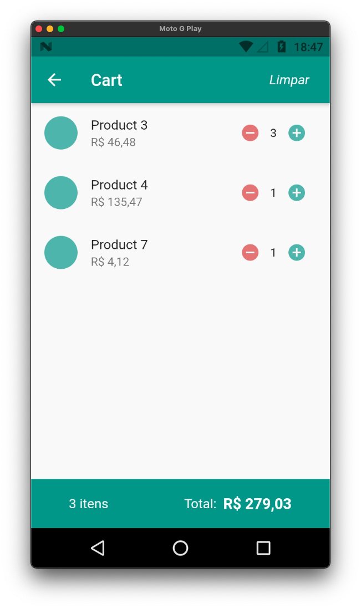

# LevelUP#5

Como tarefa dessa semana e já combinado em sala de aula, a ideia é que desenvolvamos um carrinho de compras 
utilizando de gerencia de estado, como vimos na aula do dia 20/07, o MobX!

## Features

Nesse desafio esperamos ter as seguintes telas e funcionalidades :

- Listagem de produtos
- Carrinho de compras
- Adicionar itens ao carrinho
- Atualizar o componente de contador de itens do carrinho sem atualizar a tela completa

## Packages 
  
- mobx: ^2.0.1
- flutter_mobx: ^2.0.0
- intl: ^0.17.0
- provider: ^5.0.0
- build_runner: ^2.0.6
- mobx_codegen: ^2.0.1+3

## Screenshots
 

  
   

  
   

  
   

  

